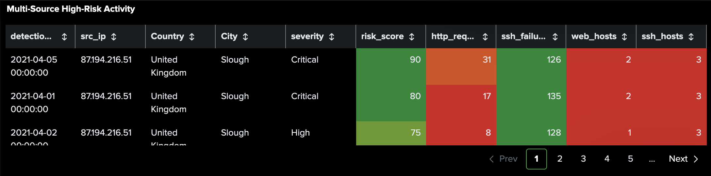
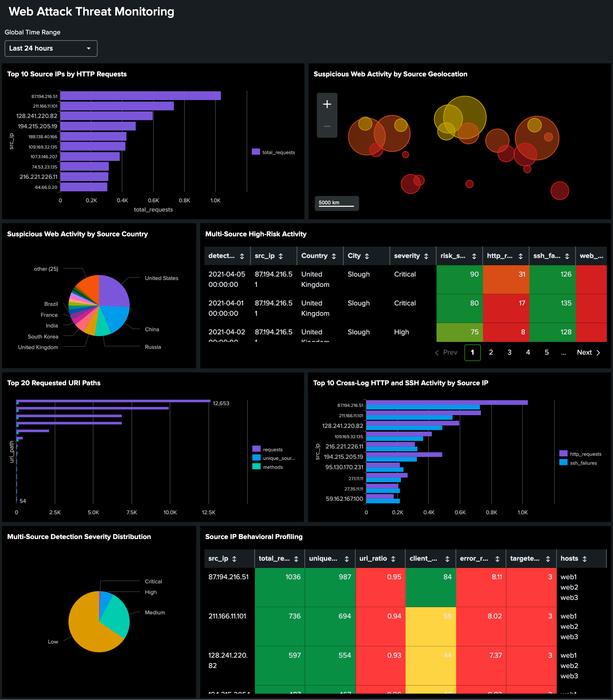
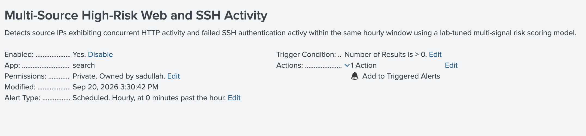

# Splunk Multi-Source Threat Hunting

Hands-on SOC threat hunting project using Splunk SPL to analyze web activity, correlate HTTP and SSH authentication telemetry, enrich source IPs with geolocation, apply multi-signal risk scoring, and operationalize the resulting detection through a dashboard and scheduled alert.

> **Lab Project:** This repository documents a hands-on Splunk investigation performed in a lab environment. It is not presented as professional SOC experience or as a production-validated detection.

---

## Project Overview

The investigation began with web access-log analysis and source-IP behavioral profiling.

A hypothesis-driven URI hunt was then performed to look for common web attack indicators. The defined rules did not identify classic administrative discovery, sensitive-file discovery, path traversal, or injection-like URI patterns.

Rather than treating unusual web behavior as proof of an attack, the investigation pivoted to a stronger signal: correlating web activity with failed SSH authentication telemetry.

The resulting workflow was:

**Web Analysis → Behavioral Profiling → URI Investigation → Cross-Log Correlation → Temporal Correlation → Geolocation → Risk Scoring → Detection → Dashboard → Alerting**

---

## Data Sources

Two primary telemetry sources were analyzed in Splunk:

| Data Source | Splunk Configuration | Purpose |
|---|---|---|
| Web access logs | `index=web sourcetype=access_combined` | HTTP activity analysis |
| Linux authentication logs | `index=security sourcetype=linux_secure` | Failed SSH authentication analysis |

### Dataset Summary

- **39,532** web access events
- **3** web servers
- **25,099** failed SSH password events used for authentication analysis

---

## Investigation Architecture

```text
                     ┌─────────────────────┐
                     │    Web Access Logs   │
                     └──────────┬──────────┘
                                │
                                ▼
                     Source IP Profiling
                                │
                     URI / Error Analysis
                                │
                                ├───────────────┐
                                │               │
                                ▼               │
                     Geolocation Enrichment     │
                                                │
┌─────────────────────────┐                     │
│ Linux SSH Auth Logs     │                     │
└────────────┬────────────┘                     │
             │                                  │
             ▼                                  ▼
      Failed Authentication ───────► Cross-Log Correlation
                                                │
                                                ▼
                                      1-Hour Temporal Correlation
                                                │
                                                ▼
                                        Multi-Signal Risk Score
                                                │
                                                ▼
                                      Medium / High / Critical
                                                │
                                      ┌─────────┴─────────┐
                                      ▼                   ▼
                                  Dashboard         Scheduled Alert
```

---

## 1. Web Source-IP Behavioral Profiling

Raw web events were parsed with SPL field extractions and aggregated by source IP.

Behavioral metrics included:

- Total HTTP requests
- Unique URIs
- HTTP 4xx client errors
- Error rate
- URI diversity
- Number of targeted web hosts

Example:

```spl
index=web sourcetype=access_combined
| rex field=_raw "^(?<src_ip>\d{1,3}(?:\.\d{1,3}){3})"
| rex field=_raw "\"(?<http_method>GET|POST|PUT|DELETE|HEAD|OPTIONS|PATCH)\s+(?<uri>\S+)\s+HTTP"
| rex field=_raw "\"\s+(?<status>\d{3})\s+"
| stats
    count AS total_requests
    dc(uri) AS unique_uris
    count(eval(status>=400 AND status<500)) AS client_errors
    dc(host) AS targeted_hosts
  by src_ip
| eval uri_ratio=round(unique_uris/total_requests,2)
| eval error_rate=round((client_errors/total_requests)*100,2)
| sort - total_requests
```

This established a behavioral baseline before moving into multi-source analysis.

---

## 2. URI Threat Hunting

URI paths were normalized by separating the path from query parameters:

```spl
| eval uri_path=mvindex(split(uri,"?"),0)
```

Frequently requested application paths included:

```text
/cart.do
/product.screen
/category.screen
/oldlink
/product.do
```

A separate hypothesis-driven hunt tested for patterns associated with:

- Administrative/authentication discovery
- Sensitive-file discovery
- Path traversal
- Injection-like requests

### Finding

**No events matched the defined suspicious URI rules.**

This result was intentionally retained as part of the investigation.

High URI diversity was not independently classified as malicious because session IDs and query-string variations can significantly increase the number of unique full URIs.

---

## 3. HTTP + SSH Cross-Log Correlation

Web and SSH logs represented source IPs differently.

Separate fields were extracted and normalized:

```spl
| rex field=_raw "^(?<web_src_ip>\d{1,3}(?:\.\d{1,3}){3})"
| rex field=_raw "from (?<ssh_src_ip>\d{1,3}(?:\.\d{1,3}){3})"
| eval src_ip=coalesce(web_src_ip,ssh_src_ip)
```

This enabled correlation across two independent telemetry sources.

One notable source IP observed during the investigation was:

```text
87.194.216.51
HTTP requests:       1,036
Failed SSH attempts:   730
```

The presence of the same source IP in both telemetry sources was treated as an investigative lead rather than proof of malicious activity or compromise.

---

## 4. Temporal Correlation

Cross-log correlation was strengthened by introducing a one-hour time window:

```spl
| bin _time span=1h
```

A correlated observation required the same source IP to generate:

- HTTP activity
- Failed SSH authentication activity

within the same one-hour window.

### Result

**183 source-IP/hour observations** contained both HTTP and failed SSH activity.

This reduced the weakness of simple all-time IP overlap and provided stronger temporal context for investigation.

---

## 5. Source-IP Geolocation Enrichment

Splunk's `iplocation` command was used to enrich public source IPs:

```spl
| iplocation src_ip
```

Country and city information was then incorporated into investigation tables and dashboard visualizations.

> Geolocation represents the estimated location associated with a source IP. It does **not** prove the physical location or identity of an attacker.

---

## 6. Multi-Signal Risk Scoring

Instead of alerting on every correlated observation, a lab-tuned scoring model was created.

Signals included:

| Signal | Condition | Score |
|---|---|---:|
| SSH volume | `>=100` failures | +40 |
| SSH volume | `>=50` failures | +25 |
| SSH volume | `>=20` failures | +10 |
| HTTP volume | `>=25` requests | +20 |
| HTTP volume | `>=10` requests | +10 |
| HTTP volume | `>=5` requests | +5 |
| Cross-log correlation | HTTP + SSH present | +20 |
| SSH host spread | `>=3` hosts | +10 |
| Web host spread | `>=3` hosts | +10 |

Maximum theoretical score: **100**

### Severity Classification

```text
Critical    80+
High        60–79
Medium      40–59
Low         <40
```

These weights are **lab-tuned investigation values**, not statistically validated production thresholds.

---

## 7. Risk Model Validation

The model was tested against all 183 temporally correlated observations.

| Severity | Observations |
|---|---:|
| Critical | 2 |
| High | 12 |
| Medium | 49 |
| Low | 120 |
| **Total** | **183** |

High + Critical represented a relatively small subset of the correlated activity.

The final detection threshold was set to:

```spl
| where risk_score>=40
```

This removed Low-severity observations from the detection pipeline.

### Final Result

**63 Medium, High, or Critical detection results**

```text
183 correlated observations
          │
          ▼
   Multi-Signal Scoring
          │
    ┌─────┴─────┐
    │           │
  120 Low    63 Detections
  Filtered       │
                 ├── 49 Medium
                 ├── 12 High
                 └──  2 Critical
```

---

## 8. Final Detection Logic

The final SPL combines:

- Multiple indexes
- Regex field extraction
- Field normalization
- Hourly time bucketing
- Conditional aggregation
- Host diversity
- Risk scoring
- Severity classification
- Geolocation enrichment
- Detection filtering

The complete detection is available here:

[`spl/07-final-multisource-detection.spl`](spl/07-final-multisource-detection.spl)
### Detection Results



---

## 9. Splunk Dashboard

A Splunk dashboard was created to provide analyst visibility across the investigation.

Dashboard panels include:

- Top Source IPs by HTTP Requests
- Source-IP Geolocation
- Source Country Distribution
- Multi-Source High-Risk Activity
- Top Requested URI Paths
- HTTP + SSH Cross-Log Activity
- Detection Severity Distribution
- Source-IP Behavioral Profiling

### Dashboard



---

## 10. Scheduled Detection Alert

The final detection was operationalized as a scheduled Splunk alert:

**Multi-Source High-Risk Web and SSH Activity**

Configuration:

```text
Schedule:          Hourly
Cron:              0 * * * *
Search window:     -70m@m to -10m@m
Trigger condition: Number of Results > 0
Trigger mode:      Once
Action:            Add to Triggered Alerts
```

### Alert Configuration



Because the project uses historical telemetry, no fired alert event is claimed.

---

## SPL Techniques Demonstrated

This project uses several SPL techniques relevant to SOC investigation and detection engineering:

- `rex`
- `stats`
- `dc()`
- `count(eval())`
- `eval`
- `case()`
- `if()`
- `coalesce()`
- `bin`
- `where`
- `sort`
- `table`
- `split()`
- `mvindex()`
- `iplocation`
- Conditional multi-source aggregation
- Temporal correlation
- Risk scoring

---

## Repository Structure

```text
splunk-multisource-threat-hunting/
│
├── README.md
│
├── docs/
│   └── investigation-findings.md
│
├── screenshots/
│   ├── dashboard.png
│   ├── detection-results.png
│   └── alert-configuration.png
│
└── spl/
    ├── 01-web-data-assessment.spl
    ├── 02-source-ip-behavioral-profiling.spl
    ├── 03-source-geolocation-analysis.spl
    ├── 04-http-ssh-cross-log-correlation.spl
    ├── 05-hourly-temporal-correlation.spl
    ├── 06-multisource-risk-scoring.spl
    └── 07-final-multisource-detection.spl
```

---

## Key Findings

- Web traffic was profiled by source IP before applying threat-hunting logic.
- Defined classic suspicious URI patterns were **not observed** in the dataset.
- HTTP and SSH telemetry were successfully normalized and correlated.
- **183** source-IP/hour observations contained concurrent HTTP and failed SSH activity.
- A multi-signal risk model reduced those observations to **63 Medium+ detections**.
- The model identified **2 Critical**, **12 High**, and **49 Medium** observations.
- Source-IP geolocation was used as enrichment, not attribution.
- The final detection was operationalized through a Splunk dashboard and hourly scheduled alert.

---

## Investigation Limitations

This project is intentionally treated as a lab investigation.

Important limitations include:

- Source-IP overlap does not prove that HTTP and SSH activity share malicious intent.
- Temporal correlation does not prove compromise.
- IP geolocation does not establish attacker identity or physical location.
- Risk-score weights were manually tuned for this dataset.
- The thresholds require additional validation before use in a production environment.
- High URI diversity may be influenced by application/session parameters.
- No classic suspicious URI patterns were identified using the defined hunting rules.

---

## Skills Demonstrated

**SIEM:** Splunk Enterprise  
**Query Language:** SPL  
**Analysis:** Web log analysis, Linux authentication analysis  
**Threat Hunting:** Behavioral analysis, hypothesis testing  
**Correlation:** Multi-source and temporal correlation  
**Enrichment:** Source-IP geolocation  
**Detection Engineering:** Multi-signal risk scoring and severity classification  
**Visualization:** Splunk dashboards  
**Operationalization:** Scheduled Splunk alerting

---

## Disclaimer

This repository documents a cybersecurity lab project created for hands-on learning and portfolio development.

The findings and thresholds are specific to the lab dataset and should not be interpreted as production security conclusions without additional validation.
